[📚 What's it for?](#use-cases) | [⚙️ How does it work?](#how-it-works) | [🌐 Free & OpenSource](#open-standard)

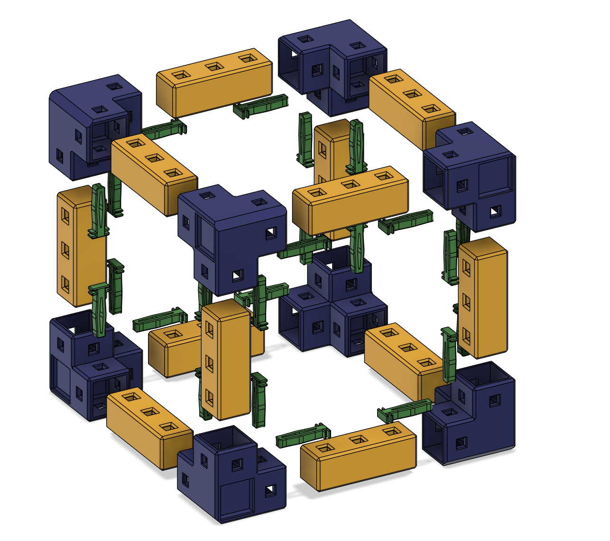

HomeRacker is a fully modular 3D-printable rack building system for virtually any "racking needs" (Server Rack, shoe rack, book shelf, you name it).

You can find all parametric and non-parametric models as well as the `f3d` files (like the `HomeRacker - Core`) on [Makerworld](https://makerworld.com/en/@kellervater)).

The parametric models can be found in the [HomeRacker GitHub Repository](https://github.com/kellervater/homeracker/tree/main/models).

> [!NOTE]
> The basic HomeRacker system is also referred to as `HomeRacker - Core`. Free for everyone to use, remix, and reshare.

# 📑 Table of Contents
- [🔧 Use Cases](#use-cases)
- [✨ Features](#features)
  - [⚙️ How it works](#how-it-works)
    - [🛠️ Assembly Basics](#assembly-basics)
    - [💡 Assembly Tips](#assembly-tips)
    - [🖨️ Printing Tips](#printing-tips)
- [📐 Tech Specs](#tech-specs)
  - [🧱 Supports](#supports)
  - [🔗 Connectors](#connectors)
  - [📏 Spring Pins](#spring-pins)
- [🌍 Open Specs](#open-specs)
- [❓ Why the name?](#why-the-name)
- [📜 Licensing](#-licensing)
- [🧪 Tests](#tests)
  - [⚠️ Disclaimer](#disclaimer)
  - [🔬 How I tested](#how-i-tested)
- [📋 Todos](#todos)

# 🔧 Use Cases
I created HomeRacker because I was dissatisfied with the existing solutions available online.  
Many designs were too specific, accommodating only certain devices owned by their creators. Others supported only the 10" standard, with no flexibility for deviations, often requiring additional adapters.  
As I began my homelab journey in April 2025, I wanted a modular solution that could adapt and grow with my evolving needs. This would eliminate the need to purchase larger racks or completely change concepts when the original design no longer met my requirements.

As it is my nature to overengineer everything, I came up with a more generic solution to serve ANY "racking needs." Be it to build a small rack for a few Raspberry Pi's, a 10" standard rack for homelabs, or even a 19" standard rack (still working on that though). You can even create bookshelves, shoe racks, or combine all of the above in an abomination of a rack.

To give you an idea of how this may look (10" rack, half-constructed Pi mini-rack, bookshelf):
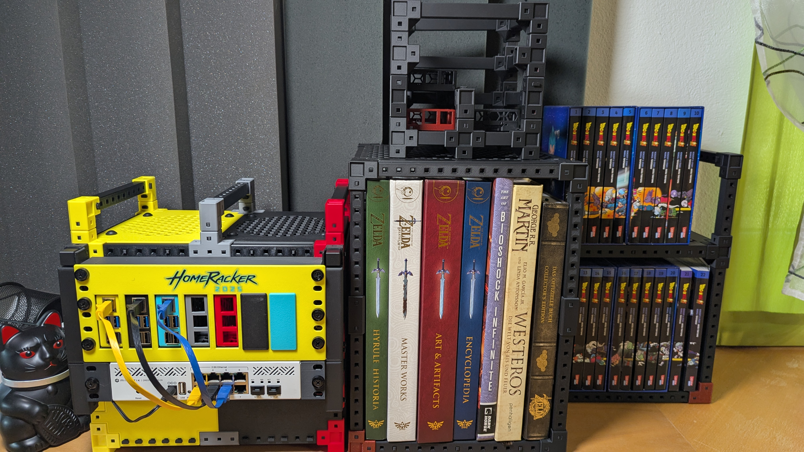

Aside from the basic [building blocks](#basic-building-blocks), the rack above also contain the following parts:
* **10" Rack**
  * HomeRacker - 10" Rackmount Kit (Todo: link to Makerworld Model) for standard height units
  * Raspi 5 Mount Kit
    * Vertical Mount Adapter for HomeRacker
    * Front-Panel for 10" racks
  * Rackmount Ears for the Switch. These are fully customizable rackmount ears which I created as an [openSCAD file](./models/rackmount_ears/rackmount_ears.scad). You can customize it directly [here](https://makerworld.com/en/models/1259227-fully-customizable-rackmount-ears#profileId-1283271).
  * HomeRacker Airflow Kit (Todo: link to Makerworld Model) which consists of:
    * Front/Back panels
    * Side panels
    * Bottom/Top panels with air intake/exhaust grid and bores for standard fans (80/92/120mm)
* **Shelf** (You can build any shelf)

# ✨ Features
The `HomeRacker - Core` features:
* **Full modularity** - Due to the support-connector system, you can scale out in any spatial dimension accessible to humans. The only limit may be the material strength (set aside money, space and time).
* **3D-printable** - The entire core system is printable, and no additional tools are required to assemble it.
* **No supports** - Not a single part of the core system needs printed supports.
* **OpenSource** - Feel free to build your own adapters and/or use it in all your personal or commercial projects (see [Open Standard](#open-standard) and [Licensing](#-licensing) for details).

## ⚙️ How it works
> **tl;dr** Think of a rack shape you want to build, download the model (insert link), print it, assemble it, and add your own mounts/adapters/you-name-it.

I might post a YouTube video here to outline how it works.

### 🛠️ Assembly Basics

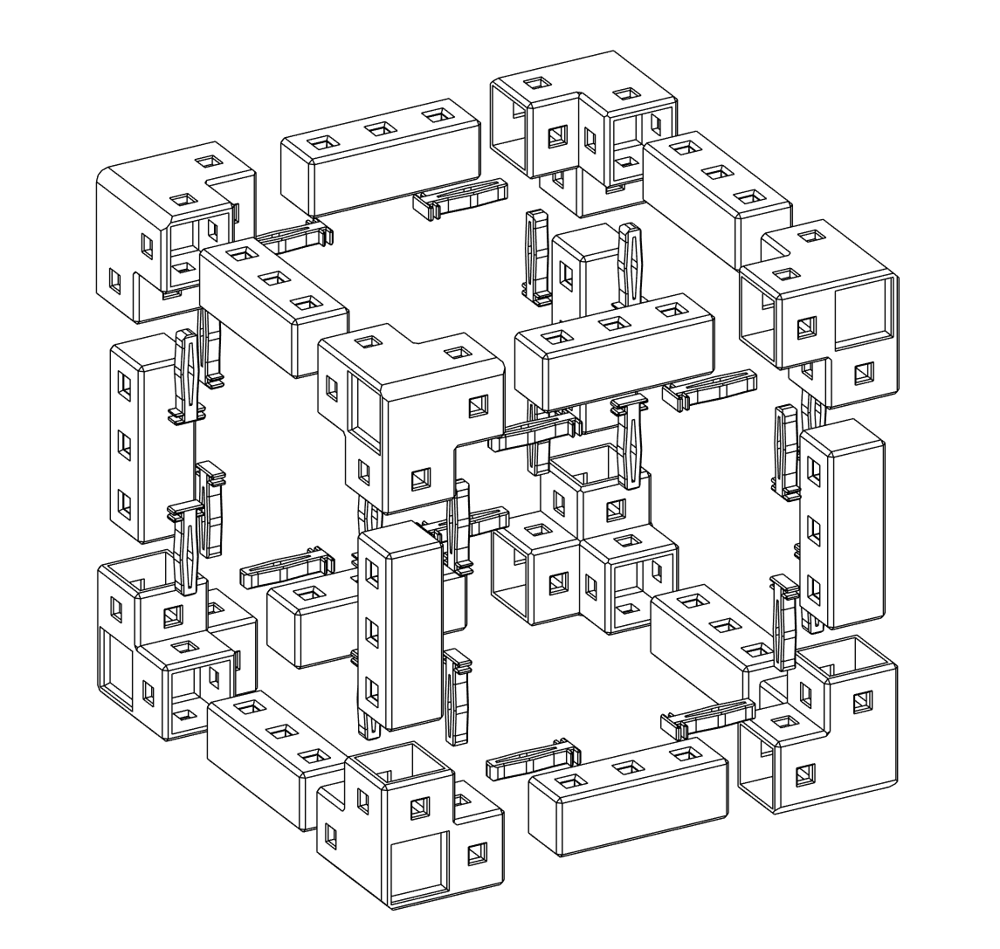

The assembly process for the `HomeRacker - Core` system is straightforward and requires no additional tools. Follow these steps:

1. **Prepare the Components**: Download the HomeRacker-Core (Todo: insert link) and print all parts required to assemble your specific rack. Ensure the parts are clean and free of debris.
2. **Connect Supports and Connectors**: Attach the connectors to the supports as per your desired configuration. The modular design allows for flexibility in size and shape.
3. **Secure with Spring Pins**: Use the spring pins to lock the connectors and supports in place. This ensures stability and prevents accidental disassembly. Due to their quadratic profile, they can be inserted horizontally or vertically. 
4. **Add Additional Features**: Depending on your use case, attach shelves, panels, or other accessories to complete your rack (not part of the core system though).

### 💡 Assembly Tips

> [!NOTE]
> **Pro-Tip**: I created a sample 10" Cyberpunk-themed 3D model on Makerlab (todo: insert link), where you can get an idea of which parts are needed for such a model.  

1. Make sure you have a clear idea of what you want to build and make a list of materials you need.  
Otherwise, you'll end up with an army of parts like me:
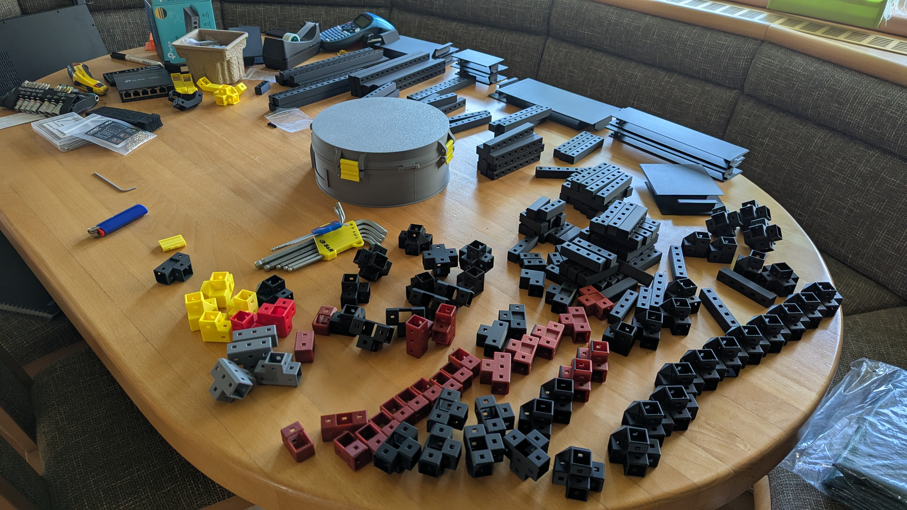
So, best make a list of materials containing:
  * How many supports of what length (measured in `base units`)
  * How many connectors of what dimensional scope? (Do you need Pull-Throughs, Feet, normal connectors?)
  * Print a large number of spring pins. You'll need more than you think. The model (todo: insert link) on Makerworld should contain a plate with 100 spring pins and a [Gridfinity](https://gridfinity.xyz/) box to store them. Print one copy, and you should be off to a good start.
2. Assemble layer-by-layer. Start with the bottom frame, then add vertical supports to it. Then build the intermediate/top frame(s) and put them onto the vertical supports. Repeat until satisfied!
3. Make sure the spring pins are fully inserted! Sometimes you need to use gentle force.

### 🖨️ Printing Tips
1. If you're unsure about bed adhesion while printing: Add a brim to the supports. I already had 1-2 cases where the small contact surface of the connectors caused them to lose bed adhesion and resulted in partial failures.
2. Anti-Warping guidelines: Always make sure to have a dust- and oil-free printing plate. A fingerprint alone can cause warping and/or bed adhesion failures.

> [!NOTE]
> **Pro-Tip**: If you need to disassemble your rack for any reason and the spring pin fits so tightly that you can't pull it out, just press a pin from the other side onto the pin in question. This should help remove it.

## 📐 Tech Specs
> [!NOTE]
> To inspect the actual values I highly recommend checking out the somewhat okISH original fusion (`f3d`) files which are ALWAYS part of my Makerworld uploads. I always parameterize my designs so they can scale without problem.

The entire system revolves around 4 simple numbers:
1. `15mm` - This is the so called `base_unit` or `base_length` in all my models. It ressembles the side length of each side of a support. x and y are fixed to 15mm and z is always a multiple of this depending on the desired unit count of a support
2. `4mm` - Is the side length of each side (xy) of a `spring pin` and it's corresponding holes in the supports. The holes are always centered along an xz base_unit.
3. `2mm` - Is the `strength` of the connector walls.
4. `0.2mm` - The `tolerance` added to the side inner side length of each connector to compensate any printing/material inaccuracies.

> These numbers (except for the tolerance) are purely arbitrary because I assumed they made sense. There wasn't any static calculation behind it.

Now to the detailed schematics:

### 🧱 Supports
Supports are the spine of the HomeRacker system. They literally support the weight the rack will have to bear.

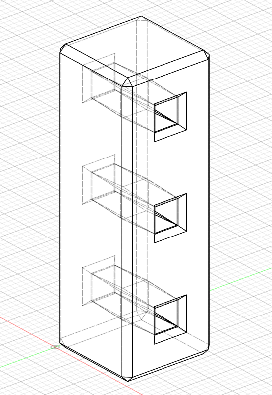

As already described above: A support has a fixed side length for its x and y side of `15mm` and the z-side is always a multiple of this `base_unit`.

E.g.: A support of 3 units has an actual height of 45mm. A Support of 17 units, 255mm.

For each height unit there's always a hole for a spring pin which measures 4mm each side.
* A hole does have the same inner measurements as the spring splints do on the outside with no tolerances.
* A hole is formed convex in 2 dimensions (x and z axis) so they can fit the spring pin in a vertical and horizontal direction.

See the following schematics for details (front view, side view, top view):

**Front View**  
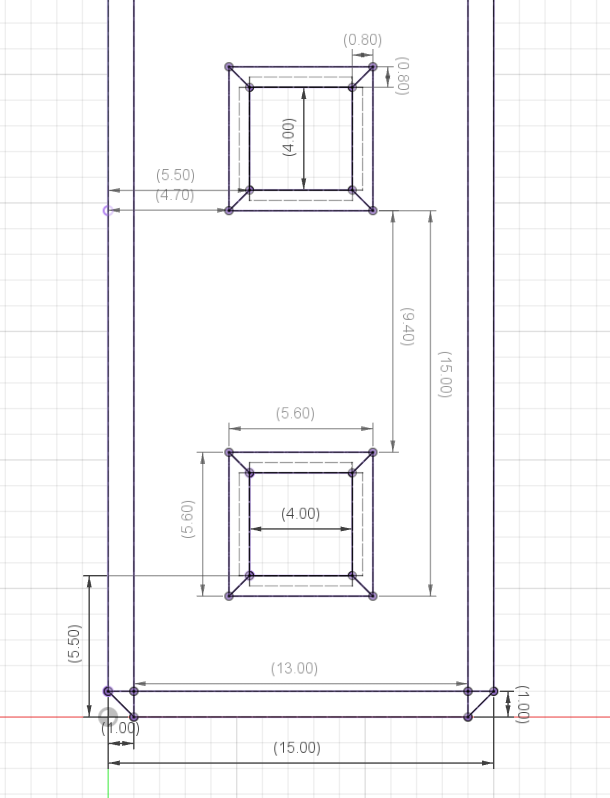

**Side View**  
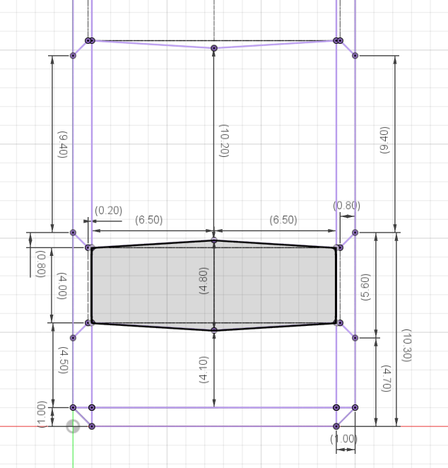

**Top View**  
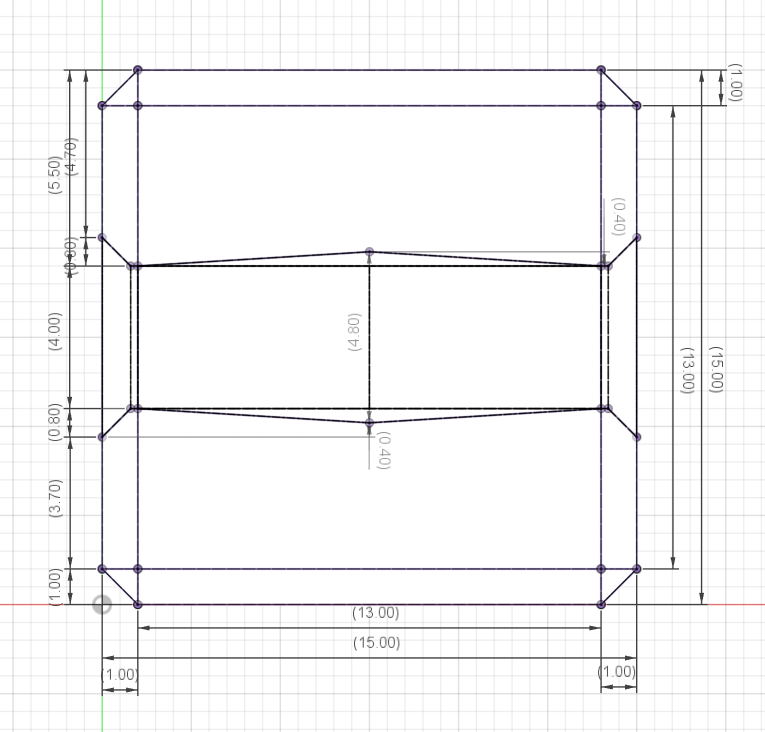

### 🔗 Connectors
Connectors are used to connect supports in 1-3 dimensions, from a straight line to extend a support, up to a 6 way connector in 3 dimensions as center piece of a complex rack structure.
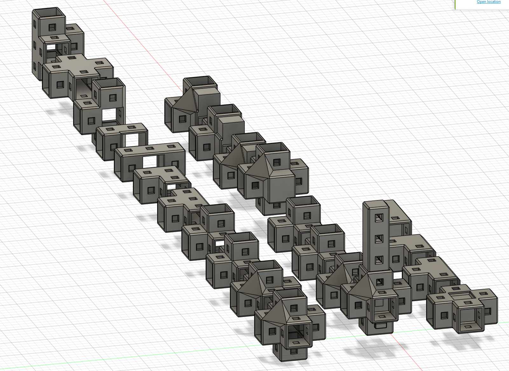

In above's picture you can see all permutations of all 3 types of connectors, which are:
* Standard -> they have a solid center and act are normally used for load bearing parts.
* Pull-Through -> In contrast to the standard connectors, they do not have a solid center part. Instead there's an opening where you can pull-through a support. They are used for complex rack builds like the 10" rack pictured above.
* Feet -> Besides the solid center, they also have a solid end piece instead of a support inlet. They are used - like the name suggests - as feet (e.g. for the rack build above to allow air intake from the bottom)

> [!IMPORTANT]
> To make it simple for a user to calculate heights, the center of a connector is always 1 `base_unit` and doesn't add any tolerances or other fluff. So if you connect 2 x3 supports with a standard connector you'll end up having exactly 7 `base_units` or 105mm in length.

Here's the schematics of a basic connector:

**Top View - Outer Measurements**
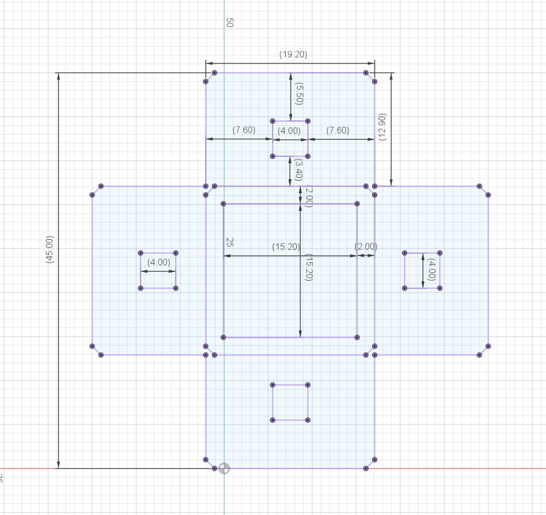

**Top View - Inner Measurements**

### 📏 Spring Pins
Spring pins are used to keep supports and connectors in place, so it doesn't fall apart when moving it.
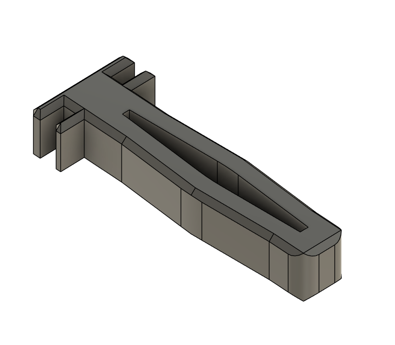

The pins contain the actual 🪄 "magic" of the HomeRacker system. Since they have a convex base shape, they need to squeeze into the holes of the supports, where they will reapply their original shape, when in place. This spring-lock ensures that they don't just fall out when they get bored.

Here's the schematics of a spring pin:

**Top View**
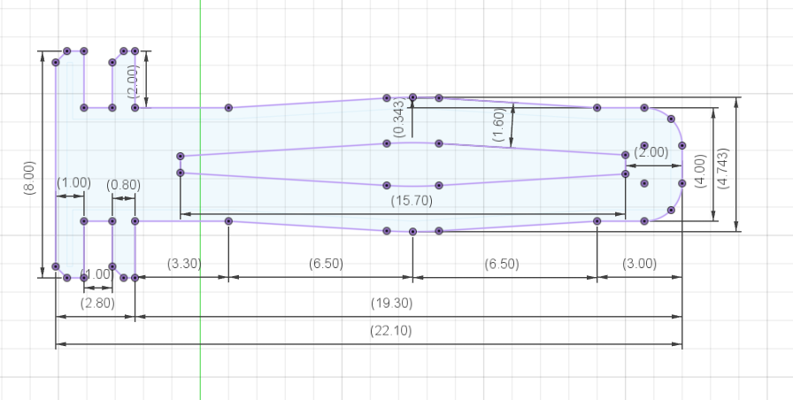

**Side View**
> Don't ask me why the height is 3.791mm here. Originally intended was 4mm, but it doesn't harm functionality, so I just left it as it is.
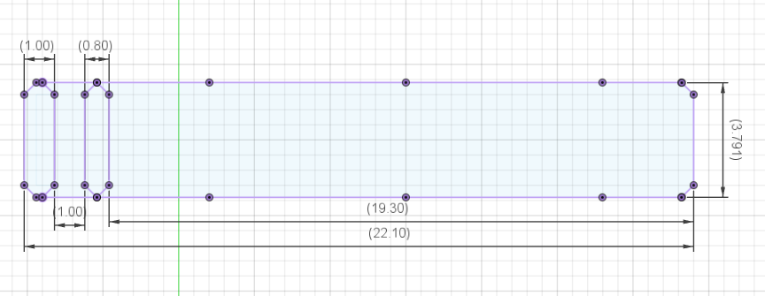

> I am still not a 100% convinced that the grip of the pin is good enough. Maybe I'll change that in the future to allow better grip AND better stability. We'll see. In any case, the base dimensions will stay the same to be downwards-compatible.

## 🌍 Open Specs
I created the `HomeRacker - Core` system to (maybe) be an open spec which every maker can build upon with (almost) no strings attached (see [Licensing](#-licensing) for details). Maybe it even becomes an Open "Standard" one day.

Therefore I highly encourage all of you to create your own models building upon the HomeRacker system.
If you let me know about your projects, I will feature them here on this site and cross-link them on MakerWorld (provided they get my "totally objective" stamp of approval). Just [create an issue](https://github.com/kellervater/homeracker/issues/new) here if you want to be featured!

# ❓ Why the name?
Following about four hours of research, I discovered that all my initial naming ideas (such as UniRack, OpenRack, etc.) were already in use by other creators or companies.

So, HomeRacker is a bit of a tongue-in-cheek creation. It combines the practical ability to build racks for homelabs with a more humorous, if slightly concerning, potential to literally become a "homewrecker" when the joy of building racks consumes too much time that could be spent with loved ones.

# 📜 Licensing

> [!NOTE]
> tl;dr - Use it for ANY purpose (even commercial), but don't forget to give credit and to share it the same way!

* The source code in this repository is licensed under the `MIT License` (see [LICENSE](./LICENSE)).
* All 3D models and creative assets (in /models/) are licensed under the `CC BY 4.0 License` (see [/models/LICENSE](./models/LICENSE)).

These licenses apply ONLY to the `HomeRacker - Core` system and the customizable rackmount ears. So, basically all content of this repository.

> [!IMPORTANT]
> All other models and derivates of HomeRacker I created may be released under less permissive licenses. But this will be disclosed at the respective models on MakerWorld.

# 🧪 Tests
Of course I tested stuff... It took me 4 months from the idea to the first release here.
Look at the prototypes:

## ⚠️ Disclaimer
> [!WARNING]
> This project is provided "as is" without any warranty of any kind. Use it at your own risk. The creators are not responsible for any damage, injury, or loss caused by the use of this project or its components. Always ensure proper safety precautions when assembling or using the HomeRacker system.

Aside from the scary warning above, I need to mention, that due to the high modularity of this system combined with limited time and resources I was of course not able to test every combination of filaments, printers, print-settings, room conditions (temperature, humidity) or to do extensive load-bearing tests.

What I want to say:
I feel like the model turned out to be really nice and versatile. That's why I shared it in the first place.
But since I do not have control over the manufacturing conditions of any consumer of this model, I cannot give any guarantees on how your specific print will turn out in the end. There are just too much variables which not even the best model design can compensate for. (Writing this feels a bit like an upfront apology... seems like I'm a people pleaser)

## 🔬 How I tested
My setup is as follows:
* a room temperature between 17 and 25°C
* Humidity levels between 29% and 36% (depends on when I'm doing my laundry)
* A BambuLab X1C printer
* Exclusively BambuLab filament (haven't tried others yet)
  * PLA Matte (I love the charcoal color. Looks so silky)
  * PLA Basic
  * ABS
* mostly I used the Textured PEI plate. It just works (provided you regularly clean it using Isopropyl alcohol). For the rest of the time I tried out the Cold Plate Super Track (it's nice but very hard to get your prints of the plates when it cools)

All above's filament types can be be combined in any possible way (just make sure you do flow calibration before using new filaments. First ABS print turned out horribly just because I forgot to click the calibration checkbox).
E.g.: you could print a connector in ABS, a support in PLA Matte and a spring pin in PLA and they will just fit when being assembled.

> 🛠️ **Btw:** I am not affiliated with Bambu in any way besides uploading my models to MakerWorld and occasionally making use of their Exclusive Model program. But they don't pay me for naming their products anywhere else (I wish 😉).

# 📋 Todos
* [ ] Rename Building blocks in f3d (did bad translations from german to english there)
* [ ] Release models on MakerLab
  * [ ] HomeRacker - Core (under above's license, non-exclusive)
  * [ ] HomeRacker - 10" Rackmount Kit (exclusive)
  * [ ] HomeRacker - Pi5 Mount Kit (exclusive)
  * [x] Customizable Rackmount Ears
  * [ ] HomeRacker - Airflow Kit (exclusive)
  * [ ] HomeRacker - Shelf
* [ ] Can we even call it a standard yet?