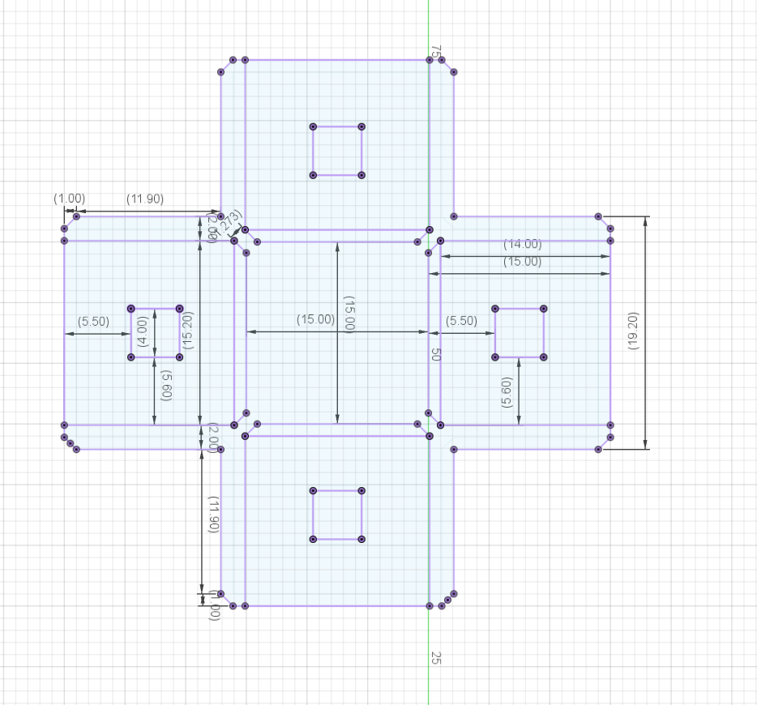

[📚 What's it for?](#-use-cases) | [⚙️ How does it work?](#-features) | [🌐 Free & OpenSource](#-open-specs) | [🤝 Contributing](CONTRIBUTING.md)

HomeRacker is a fully modular 3D-printable rack-building system for virtually any “racking needs” (server rack, shoe rack, bookshelf, you name it).

You can find all parametric and non-parametric models, as well as the `.f3d` files (like the `HomeRacker - Core`), on [Makerworld](https://makerworld.com/en/@kellerlab).

The parametric models are available in the [HomeRacker GitHub Repository](https://github.com/kellervater/homeracker/tree/main/models).

> 💡 **Note**
> The basic HomeRacker system is also referred to as `HomeRacker - Core`. Free for everyone to use, remix, and reshare.

# 📑 Table of Contents
- [🔧 Use Cases](#-use-cases)
- [✨ Features](#-features)
  - [⚙️ How it works](#%EF%B8%8F-how-it-works)
    - [🛠️ Assembly Basics](#%EF%B8%8F-assembly-basics)
    - [💡 Assembly Tips](#-assembly-tips)
    - [🖨️ Printing Tips](#%EF%B8%8F-printing-tips)
- [📐 Tech Specs](#-tech-specs)
  - [🧱 Supports](#-supports)
  - [🔗 Connectors](#-connectors)
  - [📏 Lock Pins](#-lock-pins)
  - [🌍 Open Specs](#-open-specs)
- [❓ Why the name?](#-why-the-name)
- [📜 Licensing](#-licensing)
- [🤝 Contributing](CONTRIBUTING.md)
- [🛠️ Developer Tools](#%EF%B8%8F-developer-tools)
- [🚀 Releases](#-releases)
- [🧪 Tests](#-tests)
  - [⚠️ Disclaimer](#%EF%B8%8F-disclaimer)
  - [🔬 How I tested](#-how-i-tested)

# 🔧 Use Cases
I created HomeRacker because I was dissatisfied with the existing solutions available online.
Many designs were too specific—accommodating only certain devices owned by their creators. Others supported only the 10" standard, with no flexibility for deviations, often requiring additional adapters.

As I began my homelab journey in April 2025, I wanted a modular solution that could adapt and grow with my evolving needs. This would eliminate the need to purchase larger racks or completely change concepts when the original design no longer met my requirements.

As it is my nature to overengineer everything, I came up with a more generic solution to serve ANY racking need. Be it a small rack for a few Raspberry Pis, a 10" standard rack for homelabs, or even a 19" standard rack (still working on that though). You can even create bookshelves, shoe racks—or combine all of the above into an abomination of a rack.

To give you an idea of how this may look (10" rack, half-constructed Pi mini-rack, bookshelf):

Aside from the basic [building blocks](#-tech-specs), the rack above also contains the following parts:

* **10" Rack**
  * [HomeRacker - 10" Rackmount Kit](https://makerworld.com/en/models/1353730-modular-10-server-rack#profileId-1396904) for standard-height units
  * [Raspi 5 Mount Kit](https://makerworld.com/en/models/1324096-pi-5-snapcase-for-homeracker#profileId-1360937):
    * Vertical Mount Adapter for HomeRacker
    * Front panel for 10" racks
  * Rackmount ears for the switch. These are fully customizable rackmount ears I created as an [OpenSCAD file](https://github.com/kellervater/homeracker/blob/main/models/rackmount_ears/rackmount_ears.scad). You can customize it directly [here](https://makerworld.com/en/models/1259227-fully-customizable-rackmount-ears#profileId-1283271).
  * [HomeRacker Airflow Kit](https://makerworld.com/en/models/1353730-modular-10-server-rack#profileId-1396904) (currently part of the 10" rack model), which consists of:
    * Front/back panels
    * Side panels
    * Bottom/top panels with air intake/exhaust grids and bores for standard fans (80/92/120mm)

* **Shelf** (Build any shelf configuration you like.)

# ✨ Features

The `HomeRacker - Core` features:

* **Fully modular** – Thanks to the support-connector system, you can scale in any direction. The only limits are material strength—and how much money, space, and time you have.
* **3D-printable** – The entire core system is printable, and no tools are required for assembly.
* **No supports needed** – Not a single part of the core system needs printed supports.
* **OpenSource** – Build your own adapters and use the system in personal or commercial projects (see [🌍 Open Specs](#-open-specs) and [📜 Licensing](#-licensing) for details).

## ⚙️ How it works
> **tl;dr** Think of a rack shape you want to build, download the model (insert link), print it, assemble it, and add your own mounts/adapters/whatever-you-like.

I might post a YouTube video here to show how it works.

### 🛠️ Assembly Basics

Assembly is straightforward and requires no tools:

1. **Prepare the components**: Download the HomeRacker - Core (❗Todo: insert link), and print all required parts. Clean off any debris.
2. **Connect supports and connectors**: Attach connectors to supports based on your desired configuration.
3. **Secure with Lock Pins**: Use Lock Pins to lock parts in place. They can be inserted horizontally or vertically thanks to their square profile.
4. **Add features**: Attach panels, shelves, and other accessories as needed.

### 💡 Assembly Tips

> 💡 **Pro Tip**: I created a sample 10" Cyberpunk-themed 3D model on MakerWorld (❗Todo: insert link) for inspiration.

1. Plan ahead! Otherwise, you'll end up with an army of unused parts like me:

   

   Make a parts list:
   * How many supports of what lengths (in `base units`)?
   * How many connectors of each type (pull-throughs, feet, regular)?
   * Print a ton of Lock Pins. You’ll need more than you might think. The model (❗Todo: insert link) on Makerworld should include a 100-pin plate and a [Gridfinity](https://gridfinity.xyz/) box for storage.

2. Build layer by layer: Start with the base frame, add vertical supports, then stack intermediate/top frames.
3. Make sure Lock Pins are fully inserted—gentle force might be needed.

### 🖨️ Printing Tips

1. If bed adhesion is sketchy: Add a brim to the supports. The small contact surface on connectors can cause print failures.
2. Prevent warping: Keep the print bed clean and oil-free. Even a fingerprint can cause issues.
3. When printing new filament: Make sure to calibrate the material flow!
> 💡 **Pro Tip**: If you need to disassemble and the pin is stuck, push it from the other side with another pin to release it.

## 📐 Tech Specs

> 💡 **Note** - For actual dimensions, check out the original Fusion `.f3d` files on Makerworld. All designs are fully parameterized for easy scaling.

The system is based on 4 core measurements:

1. **15mm** – The `base_unit`. Each support has 15mm x/y dimensions, with z being a multiple of 15mm.
2. **4mm** – Side length of Lock Pins and matching holes.
3. **2mm** – Wall thickness of connectors.
4. **0.2mm** – Tolerance added to connector interiors for print/material variances.

> These values (except tolerance) are arbitrary—just made sense during design.

### 🧱 Supports

Supports are the structural spine of HomeRacker.

Height is a multiple of 15mm (base units).
E.g.: A 3-unit support = 45mm tall, a 17-unit = 255mm.

Each unit height includes a 4mm hole for a Lock Pin.

* Holes match Lock Pin dimensions (no tolerance).
* Holes are convex on x and z axes for multi-directional insertion.

Schematics:

**Front View**

**Side View**

**Top View**

### 🔗 Connectors

Connectors join supports in 1 to 3 dimensions.
From straight extenders to 6-way junctions.

Types:
* **Standard** – Solid center; best for load-bearing.
* **Pull-Through** – Open center for complex builds (e.g. 10" rack).
* **Feet** – Solid end pieces; used as rack feet.

> ❗ **Important**
> Connector centers are always 1 `base_unit` in height. No offsets, no fluff.
> So: 2 × 3-unit supports + 1 connector = exactly 7 base units (105mm).

Schematics:

**Top View – Outer**

**Top View – Inner**

### 📏 lock Pins

Lock Pins hold the system together.

They rely on tension from their convex shape to stay in place.

Schematics:

**Top View**

**Side View**
> Don’t ask why the height is 3.791mm—it works. I left it as-is.

> I may tweak the pin grip in future versions for to make it easier to pull-out again. But the base dimensions will remain the same for compatibility.

## 🌍 Open Specs

I created `HomeRacker - Core` to be an open spec that any maker can build on, with (almost) no strings attached.
(See [📜 Licensing](#-licensing) for more.)

I encourage you to make your own models based on HomeRacker!
Let me know, and I’ll feature your work on this page and cross-link it on Makerworld (subject to my "very objective" approval 😄).
Just [create an issue](https://github.com/kellervater/homeracker/issues/new) if you want to be featured.

# ❓ Why the name?

After ~4 hours of research, I found all my original ideas (UniRack, OpenRack, etc.) were taken.

So, "HomeRacker" was born—part practical, part tongue-in-cheek. It fits the homelab theme, but also hints at the "home-wrecking" time sink this can become.

# 📜 Licensing

> 💡 **tl;dr**
>  – Use it for ANY purpose (even commercial), but credit me and share alike!

* Source code: `MIT License` ([LICENSE](https://github.com/kellervater/homeracker/blob/main/LICENSE))
* 3D models & creative assets (`/models/`): `CC BY 4.0 License` ([/models/LICENSE](https://github.com/kellervater/homeracker/blob/main/models/LICENSE))

These licenses apply to the `HomeRacker - Core` system and customizable rackmount ears.

> ❗ **Important**
> Other models I publish may have more restrictive licenses. This will be stated clearly on Makerworld.

HomeRacker is an unregistered trademark of Patrick Pötz (), first used publicly on 12.04.2025.

# 🛠️ Developer Tools

HomeRacker includes custom tooling to streamline development:

- **[scadm](cmd/scadm/README.md)** - OpenSCAD + library dependency manager
  - Zero-dependency Python package for installing OpenSCAD (nightly/stable) and libraries
  - Cross-platform: Windows, Linux, macOS (might work, dunno)
  - Install: `pip install scadm` → `scadm`
  - Manages dependencies from `scadm.json`

- **[Renovate Preset](renovate-dependencies.json)** - Automated dependency updates
  - Tracks OpenSCAD versions, GitHub releases, and Python packages
  - Custom rules for this project's specific needs
  - Extend in your project: `"extends": ["github>kellervater/homeracker:renovate-dependencies"]`

See [CONTRIBUTING.md](CONTRIBUTING.md) for setup instructions.

# 🚀 Releases

HomeRacker uses automated releases powered by Camunda's GitHub actions:

- **Automated versioning**: Follows [Semantic Versioning](https://semver.org/) based on [Conventional Commits](https://www.conventionalcommits.org/)
- **Changelog generation**: Automatically generated from commit messages
- **Release schedule**: Weekly auto-merge of release PRs (or manual trigger)
- **GitHub releases**: Tagged releases with changelog and version information
- **PR validation**: Pull request titles are validated to ensure Conventional Commits compliance

The release automation uses [Camunda's infra-global-github-actions](https://github.com/camunda/infra-global-github-actions/tree/main/teams/infra/pull-request) for release management and auto-merging.

To contribute and trigger releases, use conventional commit messages. See [CONTRIBUTING.md](CONTRIBUTING.md#-commit-conventions) for details.

# 🧪 Tests

Of course I tested stuff... It took ~4 months from idea to this release.
Look at all the prototypes:

## ⚠️ Disclaimer

> ⚠️ **Warning**
> This project is provided “as is,” without any warranty. Use at your own risk. I’m not responsible for damage, injury, or loss caused by using this system or its parts.

Aside from the scary warning above, I need to mention, that due to the high modularity of this system combined with limited time and resources I was of course not able to test every combination of filaments, printers, print-settings, room conditions (temperature, humidity) or to do extensive load-bearing tests.

What I want to say:
I feel like the model turned out to be really nice and versatile. That's why I shared it in the first place.
But since I do not have control over the manufacturing conditions of any consumer of this model, I cannot give any guarantees on how your specific print will turn out in the end. There are just too much variables which not even the best model design can compensate for. (Writing this feels a bit like an upfront apology... seems like I'm a people pleaser)

## 🔬 How I tested
My setup is as follows:
* a room temperature between 17 and 25°C
* Humidity levels between 29% and 36% (depends on when I'm doing my laundry)
* A BambuLab X1C printer
* Exclusively BambuLab filament (haven't tried others yet)
  * PLA Matte (I love the charcoal color. Looks so silky)
  * PLA Basic
  * ABS
* mostly I used the Textured PEI plate. It just works (provided you regularly clean it using Isopropyl alcohol). For the rest of the time I tried out the Cold Plate Super Track (it's nice but very hard to get your prints of the plates when it cools)

All above's filament types can be be combined in any possible way (just make sure you do flow calibration before using new filaments. First ABS print turned out horribly just because I forgot to click the calibration checkbox).
E.g.: you could print a connector in ABS, a support in PLA Matte and a Lock Pin in PLA and they will just fit when being assembled.

> 🛠️ **Btw:** I am not affiliated with Bambu in any way besides uploading my models to MakerWorld and occasionally making use of their Exclusive Model program. But they don't pay me for naming their products anywhere else (I wish 😉).

# Logo
I asked ChatGPT to create a logo, and I think it turned out great — so we’ll stick with it for now. This logo will also be used as an overlay image for the thumbnails of all my 3D models that are compatible with HomeRacker.

I encourage you to do the same if you create models for HomeRacker. That way, it’ll be immediately visible to users that a model is designed to be mounted on a HomeRacker system.

