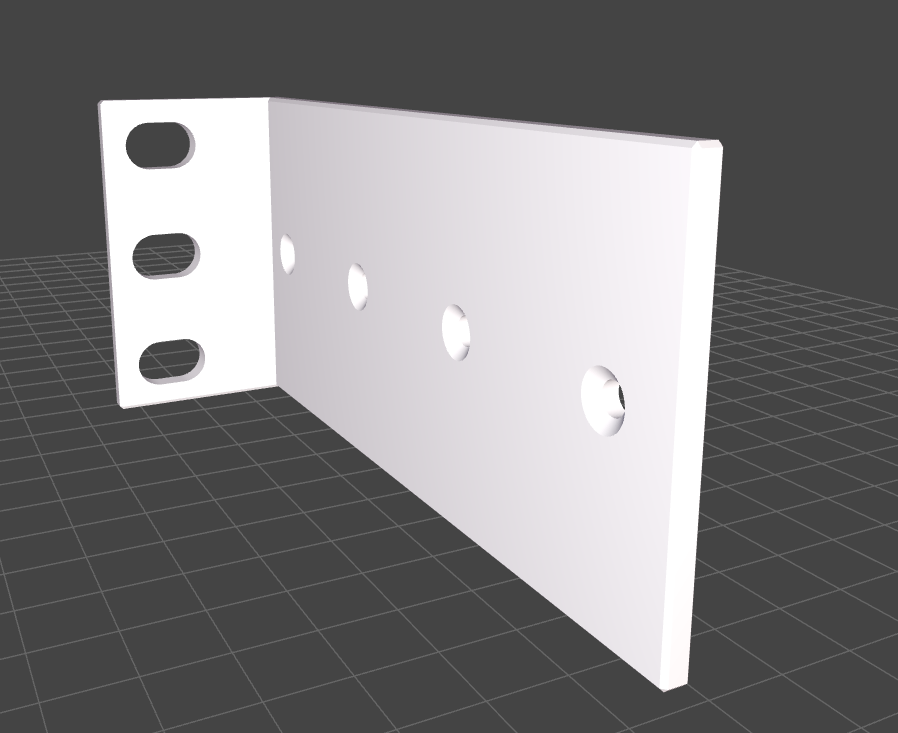
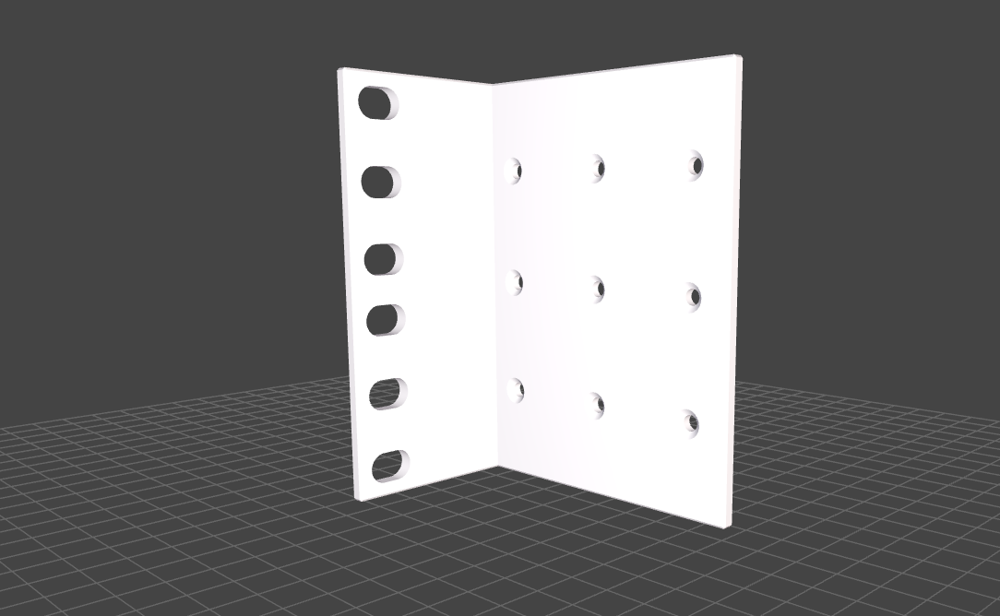

# Models
This folder contains all `scad` 3d models which come with the HomeRacker project.

## Contents
### Rackmount Ears
This is my first [OpenSCAD](https://openscad.org/) project to get a grip on it.

Here are some customization examples:

